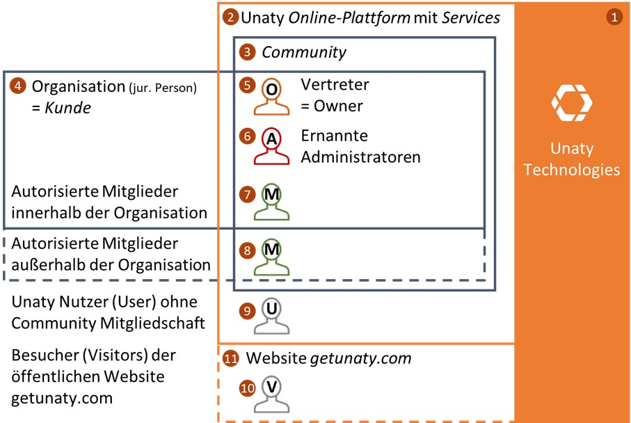

# **Unaty Datenschutzrichtlinie für Nutzer**

***

- **Verantwortliche für personenbezogene Daten auf Unaty**   
- **1. Erhebung personenbezogener Daten der Websitebesucher von www.getunaty.com**  
- **2. Erhebung von personenbezogenen Daten von Nutzern bei allgemeiner Nutzung**  
    - **Erhobene Daten**  
    - **Zwecke der Datenverarbeitung**  
    - **Rechtsgrundlage**  
    - **Speicherdauer und Steuerungsoptionen**  
- **3. Erhebung von personenbezogenen Daten bei der Kontaktaufnahme mit Unaty über Feedbackfunktionen unserer Online-Services**  
    - **Erhobene Daten**  
    - **Zwecke der Datenverarbeitung**  
    - **Rechtsgrundlage**  
    - **Speicherdauer und Steuerungsoptionen**  
- **4. Erhebung von Daten von Nutzern und Mitgliedern über die Nutzung unserer Online-Services innerhalb und außerhalb von Communities**  
    - **Erhobene Daten**  
    - **Zwecke der Datenverarbeitung**  
    - **Rechtsgrundlage**  
    - **Speicherdauer und Steuerungsoptionen**  
- **5. Erhebung von personenbezogenen Daten über Mitglieder (5-9) innerhalb von Communities durch Organisationen als Kunden von Unaty**  
- **6. Erhebung von personenbezogenen Daten über Kunden von Ownern durch Unaty**  
    - **Erhobene Daten**  
    - **Zwecke der Datenverarbeitung**  
    - **Rechtsgrundlage**  
    - **Speicherdauer und Steuerungsoptionen**  
- **Vertragsschluss und Zustimmung zu dieser Datenschutzerklärungen**  
- **Rechte betroffener Personen und wie diese wahrgenommen werden können**  
    - **A. Widerruf der Einwilligung**  
    - **B. Weitere Betroffenenrechte**  
    - **C. Kontaktwege**  
    - **D. Recht auf Beschwerde bei einer Aufsichtsbehörde**  

***

Diese Richtlinie legt dar, welche Daten Unaty über seine Internetseiten und Online-Services mit welchen Methoden und Zwecken von Nutzern und Mitgliedern erhebt.

## Verantwortliche für personenbezogene Daten auf Unaty

Für einen Teil der hier beschriebenen, auf der Unaty Plattform und erhobenen personenbezogenen Daten ist die Unaty Technologies GmbH, Unertlstraße 27, D-80803 München, Verantwortlicher. Nähere Informationen zur Abgrenzung des Unternehmens, der Website und unserer Online-Plattform und -Services findest Du unter Übersicht und Definitionen (Diese verlinkten Seiten sind als Anhang und Teil dieses Vertrages zu betrachten)

Wie in der Abbildung illustriert, ist Unaty Technologies nicht der Verantwortliche für alle Erhebungen personenbezogener Daten auf der Unaty Plattform. Wir unterscheiden folgende Datenerhebungen:

1. Erhebung von personenbezogenen Daten von Websitebesuchern (10) auf unserer Website [www.getunaty.com](http://www.getunaty.com/)
  1. Technische Erhebung von Daten über Log-Files
  2. Erheben von Daten über Cookie- und Tracking Technologien
  3. Erhebung von Daten im Zuge der Kontaktaufnahme mit Unaty Technologies oder dem bestellen von Newsletter- oder Update-E-Mails
2. Erhebung von personenbezogenen Daten von Nutzern (9) bei allgemeiner Nutzung von Unaty außerhalb von Communities (2)
3. Erhebung von personenbezogenen Daten von Nutzern (9) und Mitgliedern (5-8) bei der Kontaktaufnahme über Feedbackfunktionen unserer Online-Services innerhalb (3) und außerhalb von Communities (2)
4. Erhebung von personenbezogenen Daten von Nutzern (9) und Mitgliedern (5-8) über die Nutzung unserer Online-Services innerhalb (3) und außerhalb von Communities (2)
5. Erhebung von personenbezogenen Daten über Mitglieder (5-9) innerhalb von Communities (3) durch Organisationen als Kunden von Unaty
6. Erhebung von personenbezogenen Daten über Kunden (4) von Ownern (5) durch Unaty

Hier findest Du die vertraglichen Vereinbarungen zur Erhebung und Verarbeitung dieser Daten:

| Nr | Betroffene | Verantwortlicher | Verarbeiter | Vertrag | Kontakt | Einwilligung |
| --- | --- | --- | --- | --- | --- | --- |
| 1 | Besucher (10) | Unaty (1) | Unaty (1) | Website Datenschutzerklärung | Unaty Datenschutz | Prozess A |
| 2 | Nutzer (9) | Unaty (1) | Unaty (1) | Diese Erklärung | Unaty Datenschutz | Prozess B |
| 3 | Nutzer (9) | Unaty (1) | Unaty (1) | Diese Erklärung | Unaty Datenschutz | Prozess B |
| 4 | Nutzer, Mitglieder (5-9) | Unaty (1) | Unaty (1) | Diese Erklärung | Unaty Datenschutz | Prozess B |
| 5 | Mitglieder (5-8) | Kunde (4) | Unaty (1) | Community Datenschutzerklärung | Owner (5) als Vertreter des Kunden (4) | Prozess D, E |
| 6 | Kunde, Owner (4, 5) | Unaty (1) | Unaty (1) | Unaty Community Geschäftsbedingungen | Unaty Datenschutz | Prozess C |

Bei Fragen zur Datenerhebung durch Unaty, zu Deinen Rechten oder zur Datenschutzerklärung steht Dir als Kontakt auch unser Datenschutzbeauftragter Fabian Ahrens zur Seite. Diesen erreichst Du unter: [dataprivacy@getunaty.com](mailto:dataprivacy@getunaty.com) . Bitte nimm „Data Privacy – Persönlich&quot; in den Betreff der Nachricht auf.

## 1. Erhebung personenbezogener Daten der Websitebesucher von  www.getunaty.com

Für Informationen zu den auf unserer Website von Besuchern erhobenen Daten siehe Unaty Website Datenschutzerklärung und Cookie Richtlinie.

## 2. Erhebung von personenbezogenen Daten von Nutzern bei allgemeiner Nutzung

### Erhobene Daten:

Bei der Erstellung eines Zugangs zur Unaty Online-Plattform werden folgende Daten von uns erhoben:

- E-Mail-Adresse
- Vom Nutzer angegebener Vor- und Nachnahme
- Protokollierung der Zustimmung zu unseren Verträgen und Nutzungsbedingungen
- Protokollierung von Anmeldungen und Anmeldeversuchen

Wir übertragen diese von Dir angegebenen Daten an unseren Platform-as-a-Service-Anbieter Firebase, der von Google Ireland Limited; Gordon House; Barrow Street; Dublin 4; Irland betrieben wird. Google kann den Transfer dieser Daten in ein Land außerhalb der EU, an seine verbundenen Unternehmen, nicht ausschließen. Daher haben wir einen Auftragsdatenverarbeitungsvertrag mit Google abgeschlossen, um uns die Gewährleistung der rechtmäßigen Verarbeitung dieser Daten und Deinen Rechte an diesen Daten garantieren zu lassen.

### Zwecke der Datenverarbeitung:

E-Mail-Adresse und Name: Diese Daten sind neben einem Passwort mindestens notwendig, um bei Unaty einen wiederbenutzbaren, eindeutigen Nutzerzugang anzulegen und ist damit die Grundvoraussetzung für die Nutzung aller unserer Services.

Zustimmung zu unseren Verträgen und Nutzungsbedingungen: Die Erhebung und Verarbeitung dieser Option dient der Nachvollziehbarkeit der zwischen uns getroffenen Vereinbarungen und dient damit der Wahrung von Rechten und Pflichten von Dir und uns.

Anmeldungen und Anmeldeversuche: Diese Daten werden lediglich zur Sicherstellung Deiner Zugangssicherheit verarbeitet, beispielsweise zum Melden der Anmeldungen von neuen Geräten.

### Rechtsgrundlage:

E-Mail-Adresse, Name, Anmeldungen und Anmeldeversuche: Wir verarbeiten diese Daten auf Grundlage Deiner Einwilligung (Art. 6 Abs. 1 DSGVO) ein. Die Einwilligung gibst Du uns durch den Klick auf „Create Account&quot; bzw. „Zugang erstellen&quot; bei durch Dich gesetztem Haken an diesem Vertrag.

Zustimmung zu unseren Verträgen und Nutzungsbedingungen: Wir verarbeiten Ihre Daten, aufgrund unseres berechtigten Interesses gem. Art. 6 Abs. 1 S. 1 lit. f EU-DSGVO

### Speicherdauer und Steuerungsoptionen:

E-Mail-Adresse, Name, Anmeldungen und Anmeldeversuche: Diese Daten sind so lange bei uns gespeichert, solange ein Nutzerzugang erhalten ist, die Daten können bei Unaty mit dem Löschen des eigenen Zugangs gelöscht werden. Beachte Bitte, dass Communities auch ohne aktiven Nutzerzugang zu Unaty innerhalb ihrer Community Deinen Namen und Deine E-Mail-Adresse (und weitere Daten, siehe 5. dieser Erklärung) hinterlegt haben können. Wenn Du die Daten dort löschen lassen möchtest, wende Dich bitte an den verantwortlichen Kunden, bzw. an seinen Vertreter, den Owner der Community.

Zustimmung zu unseren Verträgen und Nutzungsbedingungen: Diese Protokollierung dient der Erfüllung von § 13 Absatz 2 TMG und kann nicht widerrufen werden.

## 3. Erhebung von personenbezogenen Daten bei der Kontaktaufnahme mit Unaty über Feedbackfunktionen unserer Online-Services

### Erhobene Daten

Wenn Du die in unserer Online-Plattform eingebauten Feedback Funktion nutzt oder dem Unaty Team aus der Plattform heraus Mitteilungen schickst, erheben und verarbeiten wir folgende Daten:

- Deinen Namen und Deine User ID
- Den Inhalt des von Dir übermittelten Anliegen
- Die Community aus der heraus Du die Mitteilung verschickt hast (falls anwendbar)
- Die Subseite unserer Plattform, von der aus Du die Mitteilung verschickt hast

Alle Daten, die Du uns so übermittelst, werden verschlüsselt zwischen Deinem Browser und unserem Server übertragen.

G-Suite: Wir nutzen G Suite als Lösung für die interne und externe Kommunikation. Wenn Du uns z.B. eine E-Mail an unser Support- oder Datenschutzpostfach sendest oder gewisse Feedback-Funktionen nutzt, wird diese in einem G-Suite (Google Mail) Postfach abgelegt und verarbeitet. Diese Zugriffe erfolgen durch vertragliche Regelungen auf der Basis eines angemessenen Datenschutzniveaus. Bei der Nutzung der G Suite lässt sich nicht ausschließen, dass die betreffenden Mitarbeiter des Partners Google Inc. (USA) oder seiner Tochtergesellschaften sowie Subunternehmern von diesen Daten Kenntnis erlangen. Die Daten werden folglich auch in Staaten außerhalb der Europäischen Union und des Europäischen Wirtschaftsraums erhoben, verarbeitet und genutzt.

### Zwecke der Datenverarbeitung

Die Datenverarbeitung erfolgt durch unseren Kundenservice oder von uns beauftragten Dienstleistern ausschließlich auf Grundlage und zur Bearbeitung Deiner Anfrage bzw. Deines Feedbacks.

### Rechtsgrundlage

Wir verarbeiten Ihre Daten zur Durchführung vorvertraglicher und vertraglicher Maßnahmen, die auf Deine Anfrage hin erfolgen (Art. 6 Abs. 1 b DSGVO).

### Speicherdauer und Steuerungsoptionen

Wir speichern Deine Daten so lange, wie wir sie für den konkreten Verarbeitungszweck, zur Gewährleistung oder zur Erfüllung gesetzlicher Aufbewahrungsfristen benötigen.

## 4. Erhebung von Daten von Nutzern und Mitgliedern über die Nutzung unserer Online-Services innerhalb und außerhalb von Communities

Wir erheben Daten über das Nutzungsverhalten der Nutzer unserer Online-Plattform. Diese Daten werden schon während der Erhebung vollständig anonymisiert und sind daher nicht personenbezogen. Zur Weiteren Sicherstellung der Unumkehrbarkeit dieser Anonymisierung und zur Vermeidung der späteren Zuordenbarkeit von Nutzungsverhalten auf einzelne Nutzer analysieren wir nur das Verhalten von Nutzern, die Communities mit mehr als 50 Mitgliedern angehören.

Obwohl dazu keine besondere Verpflichtung besteht, möchten wir in diesem 4. Abschnitt gerne erläutern, wie und warum wir diese Daten erheben, um transparent zu sein und Deine Steuerungsoptionen aufzuzeigen.

### Erhobene Daten

Bei der Nutzung unserer Services zählen wir anonym, wie viele Mitglieder und wie viele Administratoren welche Funktionen nutzen. Dabei werden keine personenbezogenen Daten erhoben. Um sicherzustellen, dass diese Nutzungszahlen nicht eindeutig zu Personen zugeordnet werden können und so de-anonymisiert werden, zählen wir die Funktionsnutzung nur bei Communities mit mehr als 50 Mitgliedern.

### Zwecke der Datenverarbeitung

Durch das Zählen der Servicenutzung und das Erstellen von Gesamtstatistiken können wir die Qualität unserer Services und der Funktionen verbessern.

### Rechtsgrundlage

Da keine personenbezogenen Daten erheben, bedarf es keiner weiteren Rechtsgrundlage außer unserer vertraglichen Regelungen an dieser Stelle.

### Speicherdauer und Steuerungsoptionen

Generell bedarf es keiner besonderen Berechtigung, nicht-personenbezogene Daten über die Nutzung unserer Plattform und unserer Services zu erheben. Wir möchten dies dennoch nur mit Deinem Konsens bzw. dem Konsens der Organisationen, denen Du auf Unaty angehörst, durchführen. Die Standard-Einstellung für die Erhebung anonymer Nutzungsdaten wird durch die Kundenorganisation bei der Erstellung der Community gesetzt. Die Kundenorganisation kann diese Einstellung jederzeit unter den generellen Einstellungen der Community ändern. Jedes Mitglied kann individuell der Erhebung von anonymen Nutzungsdaten in den individuellen Accounteinstellungen ändern.

## 5. Erhebung von personenbezogenen Daten über Mitglieder (5-9) innerhalb von Communities durch Organisationen als Kunden von Unaty

Alle Daten, die in Profilfeldern über Mitglieder erhoben werden, werden von der Kundenorganisation als Verantwortliche Stelle erhoben. Unaty wird dabei lediglich als Auftragsdatenverabeiter genutzt. Zum Zwecke der Wahrung aller Rechte der betroffenen Personen hat Deine Kundenorganisation mit Unaty einen Auftragsdatenverabeitungsvertrag geschlossen, der genau bestimmt, wie mit den durch den Kunden erhobenen Daten zu verfahren ist.

Es gibt drei Wege, auf denen Kundenorganisationen personenbezogene Daten von Dir auf Unaty erheben können:

1. Import von Mitgliedsdaten von externen Quellen, zum Beispiel durch das Hochladen von Bestandsdaten in Tabellenkalkulationsdateien.
2. Erheben von Mitgliedsdaten durch Dritte, zum Beispiel mit der Datenpflege beauftragte Rollen oder Administratoren.
3. Berechtigen des zugehörigen Nutzers von Unaty um Daten über sich selbst als Mitglied zu pflegen.

Bitte beachte, dass Du nur als Nutzer auf Unaty (c) aktiv Deine eigenen Mitgliedsdaten ändern kannst. Wenn Du Deine Betroffenenrechte bezüglich der Erhebungsmethoden (a) und (b) geltend zu machen, wende Dich bitte an die Kundenorganisation.

Für Informationen, welche personenbezogenen Daten durch die Kundenorganisation von Dir erhoben werden, mit welchem Zweck das geschieht, welche Berechtigung dazu vorliegt, wie lange die Daten gespeichert werden und wie Du der Erhebung und Speicherung widersprechen kannst, wende Dich bitte an die Kundenorganisation.

Die Kundenorganisation wird Dir gegenüber vertreten durch den sogenannten Owner, den Du unter den allgemeinen Informationen zur Community im Unaverse (allgemeiner Plattformbereich von Unaty) einsehen kannst.

## 6. Erhebung von personenbezogenen Daten über Kunden von Ownern durch Unaty

Um Geschäfte mit Kunden durchzuführen, müssen wir bestimmte Daten über den Kunden, also die Organisation hinter einer Community, erheben. Außerdem benötigen wir Kontaktinformationen zu einem Vertreter der Community, dem Owner.

### Erhobene Daten

Wir erheben hierzu

- die vollständige, rechtlich gültige Bezeichnung der Kundenorganisation
- die Anschrift der Kundenorganisation
- Kontaktdaten der Kundenorganisation
- den vollständigen Namen des Owners als rechtlicher Vertreter der Kundenorganisation
- Kontaktdaten des Owners
- Zahlungsdaten der Kundenorganisation

### Zwecke der Datenverarbeitung

Die Erhebung dieser Daten dient der Abwicklung der zwischen uns und der Kundenorganisation abgeschlossenen Verträge und damit der Wahrung von Rechten und Pflichten der Organisation und uns.

### Rechtsgrundlage

Wir erheben und verarbeiten diese Daten zur Erfüllung der Verträge, im speziellen zur Erfüllung der zischen uns und dem Kunden geschlossenen Geschäftsbedingungen, gemäß Art. 6 Abs. 1 b DSGVO.

### Speicherdauer und Steuerungsoptionen

Die Daten werden gespeichert, solange die Verträge zwischen uns und der Kundenorganisation aufrechterhalten werden. Werden die Verträge gekündigt, so bleiben die Daten nur so lange gespeichert wie Aufbewahrungspflichten in Deutschland vorschreiben (Zum Beispiel die 10-jährige Aufbewahrungspflicht von Rechnungen gemäß § 14 b Abs. 1 Satz 1 UStG.). Hier verbieten uns diese Gesetze eine individuelle Steuerung der Speicherung. Nach Ablauf von Aufbewahrungsfristen werden die personenbezogenen Daten gelöscht.

## Vertragsschluss und Zustimmung zu dieser Datenschutzerklärungen

Zur Akzeptanz der Datenschutzerklärung und dem Einsatz der hier aufgeführten Datenerhebungen und Technologien wirst Du bei der Erstellung eines Nutzerzugangs zu Unaty aufgefordert, unabhängig von Deiner Mitgliedschaft in einer Community. Ein Nutzerzugang wird bei den Prozessen B und E (Siehe dazu Übersicht und Definitionen) erstellt. Der Vertragsabschluss erfolgt durch Klicken des „Weiter&quot; bzw. „Zugang erstellen&quot; Buttons bei durch Dich gesetztem Haken an diesem Vertrag.

## Rechte betroffener Personen und wie diese wahrgenommen werden können

Folgende Rechte hast Du als betroffene Person bei der Erhebung Deiner Daten durch Unaty:

### A. Widerruf der Einwilligung

Du kannst ggf. erteilte Einwilligungen in die Verarbeitung Deiner personenbezogenen Daten jederzeit mit Wirkung für die Zukunft widerrufen. Bitte beachte, dass der Widerruf keine Auswirkungen auf die Rechtmäßigkeit der bisherigen Datenverarbeitung hat und dass er sich nicht auf solche Datenverarbeitungen erstreckt, für die ein gesetzlicher Erlaubnisgrund vorliegt und die daher auch ohne Deine Einwilligung verarbeitet werden dürfen.

### B. Weitere Betroffenenrechte

Darüber hinaus stehen Dir nach den Artikeln 15 bis 21 und 77 der EU-Datenschutzgrundverordnung (DSGVO) bei Vorliegen der gesetzlichen Voraussetzungen folgende Betroffenenrechte zu:

#### Auskunft

Du kannst jederzeit verlangen, dass wir Dir Auskunft darüber erteilen, welche Deiner personenbezogenen Daten wir wie verarbeiten und eine Kopie der von Dir gespeicherten personenbezogenen Daten zur Verfügung stellen, Art. 15 DSGVO.

#### Berichtigung:

Du kannst die Berichtigung unrichtiger personenbezogener Daten sowie die Vervollständigung unvollständiger personenbezogener Daten von uns verlangen, Art. 16 DSGVO.

#### Löschung

Du kannst die Löschung Deiner personenbezogenen Daten verlangen. Bitte beachte:

a) Teile unserer Services können nach der Löschung Deiner personenbezogenen Daten nicht mehr erbracht werden.

b) Von der Löschung ausgenommen sind Daten, die wir zur Durchführung und Abwicklung von Verträgen und zur Geltendmachung, Ausübung und Verteidigung von Rechtsansprüchen benötigen sowie Daten, für die gesetzliche, aufsichtsrechtliche oder vertragliche Aufbewahrungspflichten bestehen, Art. 17 DSGVO.

#### Einschränkung der Verarbeitung

Du kannst unter bestimmten Umständen die Einschränkung der Verarbeitung verlangen, z.B. wenn Du der Ansicht sind, dass Deine Daten unrichtig sind, wenn die Verarbeitung rechtswidrig ist oder Du Widerspruch gegen die Datenverarbeitung eingelegt hast. Dies führt dazu, dass Deine Daten ohne Deine Einwilligung nur sehr beschränkt verarbeitet werden dürfen, z.B. zur Geltendmachung, Ausübung und Verteidigung von Rechtsansprüchen oder zum Schutz der Rechte anderer natürlicher und juristischer Personen, Art. 18 DSGVO.

#### Widerspruch gegen die Datenverarbeitung

Du hast die Möglichkeit, jederzeit der Datenverarbeitung zu Direktwerbezwecken zu widersprechen. Zudem kannst Du bei Vorliegen besonderer Gründe jederzeit den Datenverarbeitungen widersprechen, die auf Grundlage eines berechtigten Interesses erfolgen, Art. 21 DSGVO.

#### Datenübertragbarkeit

Du hast das Recht, die Daten, die Du uns bereitgestellt hast und die wir auf Grundlage Deiner Einwilligung oder zur Vertragserfüllung verarbeiten, in einem gängigen, maschinenlesbaren Format zu erhalten und im Rahmen des technisch machbaren eine direkte Übermittlung dieser Daten an Dritte zu verlangen, Art. 20 DSGVO.

### C. Kontaktwege

Du kannst Deine Rechte über die folgenden Kontaktwege ausüben:

Unaty Technologies GmbH Datenschutz  
Z. Hd. Herr Fabian Ahrens, Datenschutzbeauftragter  
Kontaktadresse: Fallmerayerstraße 1a  
D-80796 München, Deutschland  
E-Mail: [dataprivacy@getunaty.com](mailto:dataprivacy@getunaty.com)

### D. Recht auf Beschwerde bei einer Aufsichtsbehörde

Wenn Du z.B. der Ansicht bist, dass unsere Datenverarbeitung rechtswidrig ist oder wir die oben beschriebenen Rechte nicht in dem notwendigen Umfang gewährt haben, hast Du das Recht, bei der zuständigen Datenschutzaufsichtsbehörde Beschwerde einzulegen.
