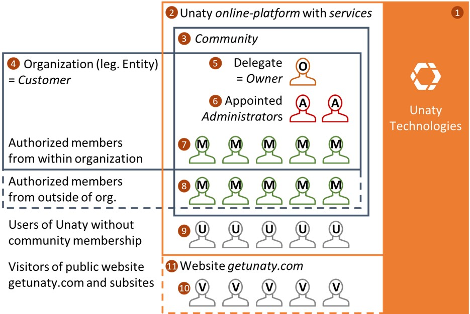

# **Unaty Data Privacy Policy for Users**

***

- **Data Controllers for personal data on Unaty**  
- **1. Collection of personal data of the website visitors of www.getunaty.com**  
- **2. Collection of personal data from users during the general use of our platform**  
 - **Data collected:**  
 - **Purposes of data processing:**  
 - **Legal basis:**  
 - **Storage duration and control options:**  
- **3. Collection of personal data when contacting Unaty via feedback functions of our online services**  
 - **Data collected**  
 - **Data processing purposes**  
 - **Legal basis**  
 - **Storage duration and control options**  
- **4. Collection of data from users and members about the use of our online services within and outside of communities**  
 - **Data collected**  
 - **Data processing purposes**  
 - **Legal basis**  
 - **Storage duration and control options**  
- **5. Collection of personal data about members (5-9) within communities by organizations as customers of Unaty**  
- **6. Collection of personal data about Owners&#39; customers by Unaty**  
 - **Data collected**  
 - **Data processing purposes**  
 - **Legal basis**  
 - **Storage duration and control options**  
- **Conclusion of contract and consent to this privacy policy**  
- **Rights of data subjects and how they can be exercised**  
 - **A. Revocation of consent**  
 - **B. Further data subject rights**  
 - **C. Contact ways**  
 - **D. Right to complain to a supervisory authority**  

***

This policy sets forth what information Unaty collects from users and members through its websites and online services, with what methods and purposes.

## Data Controllers for personal data on Unaty

Unaty Technologies GmbH, Unertlstraße 27, D-80803 Munich, Germany, is the data controller for some of the personal data described here that is collected on the Unaty platform and services. For more information on the delimitation of the company, the website, and our online platform and services, please see Overview and Definitions (These linked pages are to be considered as an appendix and part of this agreement).

As illustrated in the figure, Unaty Technologies is not the Data controller for all collections of personal data on the Unaty Platform. We distinguish the following data collections:

1. Collection of personal data from website visitors (10) on our website [www.getunaty.com](http://www.getunaty.com/)
  1. Technical collection of data via log files
  2. Collection of data via cookie and tracking technologies
  3. Collection of data while contacting Unaty Technologies, ordering newsletters, or update-e-mails
2. Collection of personal data from users (9) for general use of Unaty outside of communities (2).
3. Collection of personal data from users (9) and members (5-8) when contacting us via feedback functions of our online services within (3) and outside communities (2)
4. Collection of personal data from users (9) and members (5-8) about the use of our online services within (3) and outside communities (2)
5. Collection of personal data about members (5-9) within communities (3) by organizations as customers of Unaty.
6. Collection of personal data about customers (4) from owners (5) by Unaty

Here you will find the contractual agreements for the collection and processing of this data:

| No | Affected | Responsible | Processor | Contract | Contact | Consent |
| --- | --- | --- | --- | --- | --- | --- |
| 1 | Visitors (10) | Unaty (1) | Unaty (1) | Website Privacy Policy | Unaty Privacy | Process A |
| 2 | Users (9) | Unaty (1) | Unaty (1) | This policy | Unaty Privacy | Process B |
| 3 | Users (9) | Unaty (1) | Unaty (1) | This policy | Unaty Privacy | Process B |
| 4 | Users, members (5-9) | Unaty (1) | Unaty (1) | This policy | Unaty Privacy | Process B |
| 5 | Members (5-8) | Customer (4) | Unaty (1) | Community Privacy Policy | Owner (5) as representative of the customer (4) | Process D, E |
| 6 | Customer, Owner (4, 5) | Unaty (1) | Unaty (1) | Unaty Community Terms and Conditions | Unaty Privacy | Process C |

If you have any questions about data collection by Unaty, your rights, or the privacy policy, you can also contact our data protection officer Fabian Ahrens. You can reach him at: [dataprivacy@getunaty.com](mailto:dataprivacy@getunaty.com). Please mention &quot;Data privacy – Personal&quot; in the header of the mail.

## 1. Collection of personal data of the website visitors of [www.getunaty.com](http://www.getunaty.com/)

For information on the data collected from visitors to our website, please see the Unaty Website Privacy and Cookie Policy for Visitors of [www.getunaty.com](http://www.getunaty.com/).

## 2. Collection of personal data from users during the general use of our platform

### Data collected:

When creating an account to the Unaty online platform, we collect the following data:

- E-mail address
- First and last name specified by the user
- Logging of consent to our contracts and terms of use
- Logging of logins and login attempts

We transfer this data you provide to our Platform-as-a-Service provider Firebase, which is operated by Google Ireland Limited; Gordon House; Barrow Street; Dublin 4; Ireland. Google cannot exclude the transfer of this data to a country outside the EU, to its affiliates. Therefore, we have closed a data processing agreement with Google, in which Google guarantees the lawful processing of this data and your rights to this data.

### Purposes of data processing:

E-mail address and name: This data is, in addition to a password, at least necessary to create a reusable, unique user account at Unaty and is therefore the basic requirement for the use of all our services.

Consent to our contracts and terms of use: The collection and processing of this option serves the traceability of the agreements made between us and thus serves the preservation of rights and obligations of you and us.

Logins and login attempts: This data is processed only to ensure your access security, for example, to report the logins of new devices.

### Legal basis:

Email address, name, registrations, and registration attempts: We process this data based on your consent (Art. 6 para. 1 GDPR). You give us your consent by clicking on &quot;Create Account&quot; or &quot;Create access&quot; with a checkmark set by you on this contract.

Consent to our contracts and terms of use: We process your data, based on our legitimate interest according to Art. 6 para. 1 p. 1 lit. f EU-GDPR

### Storage duration and control options:

E-mail address, name, registrations, and registration attempts: This data is stored with us as long as a user account is maintained, the data can be deleted at Unaty with the deletion of the own account. Please note that communities may have stored your name and email address (and other data, see 5. of this statement) within their community even without active user access to Unaty. If you want to delete the data there, please contact the responsible customer or his representative, the owner of the community.

Consent to our contracts and terms of use: This logging serves the fulfillment of § 13 para. 2 TMG and can not be revoked.

## 3. Collection of personal data when contacting Unaty via feedback functions of our online services

### Data collected

When you use the feedback feature built into our online platform or send messages to the Unaty team from within the platform, we collect and process the following data:

- Your name and user ID
- The content of the request you sent
- The community from which you sent the message (if applicable)
- The subpage of our platform from which you sent the message

All data that you transmit to us in this way is encrypted and transferred between your browser and our server.

G Suite: We use G Suite as a solution for internal and external communication. For example, when you send us an email to our support or privacy mailbox or use certain feedback features, it is stored and processed in a G Suite (Gmail) mailbox. These accesses are made through contractual arrangements based on an appropriate level of data protection. When using G Suite, it cannot be ruled out that the relevant employees of the partner Google Inc. (USA) or its subsidiaries and subcontractors may become aware of this data. Consequently, the data is also collected, processed, and used in countries outside the European Union and the European Economic Area.

### Data processing purposes

The data processing is carried out by our customer service or service providers commissioned by us exclusively for the processing of your inquiry or your feedback.

### Legal basis

We process your data to carry out pre-contractual and contractual measures that are carried out at your request (Art. 6 para. 1 b GDPR).

### Storage duration and control options

We store your data for as long as we need it for the specific processing purpose, for warranty purposes or to comply with legal retention periods.

## 4. Collection of data from users and members about the use of our online services within and outside of communities

We collect data on the usage behavior of the users of our online platform. This data is already completely anonymized during collection and is therefore not personal. To further ensure the irreversibility of this anonymization and to avoid the subsequent assignability of usage behavior to individual users, we only analyze the behavior of users who belong to communities with more than 50 members.

Although there is no specific obligation to do so, we would like to explain in this 4th section how and why we collect this data to be transparent and to show your control options.

### Data collected

When using our services, we anonymously count how many members and how many administrators use which functions. No personal data is collected in the process. To ensure that these usage figures cannot be clearly assigned to individuals and are thus de-anonymized, we only count function usage in communities with more than 50 members.

### Data processing purposes

By counting service usage and compiling aggregate statistics, we can improve the quality of our services and features.

### Legal basis

Since no personal data is collected, no further legal basis is required other than our contractual regulations at this point.

### Storage duration and control options

Generally, no special authorization is required to collect non-personal information about the use of our Platform and Services. However, we would like to do so only with your consensus or the consensus of the organizations to which you belong on Unaty. The default setting for collecting anonymous usage data is set by the customer organization when the community is created. The customer organization can change this setting at any time under the general settings of the community. Each member can individually change the collection of anonymous usage data in the individual account settings.

## 5. Collection of personal data about members (5-9) within communities by organizations as customers of Unaty

All data collected about members in profile fields is collected by the customer organization as the Data Controller. Unaty is only used as a Data Processor here. To safeguard all rights of the data subjects, your customer organization has closed a data processing agreement with Unaty, which specifies exactly how the data collected by the customer is to be handled.

There are three ways in which customer organizations can collect personal information from you on Unaty:

1. Import membership data from external sources, for example, by uploading inventory data to spreadsheet files.
2. Collection of membership data by third parties, e.g., roles or administrators in charge of data maintenance.
3. Authorize the associated users of Unaty to maintain data about themselves as members.

Please note that you can only actively change your own membership data as a user on Unaty (c). If you wish to exercise your data protection rights regarding the collection methods (a) and (b), please contact the Customer Organization.

For information on which personal data is collected from you by the customer organization, the purpose for which this is done, the authorization for this, how long the data is stored, and how you can object to the collection and storage, please contact the customer organization.

The customer organization is represented to you by the so-called owner, which you can view under the general information about the community in the Unaverse (general platform area of Unaty).

## 6. Collection of personal data about Owners&#39; customers by Unaty

To conduct business with customers, we need to collect certain data about the customer, the organization behind a community. We also need contact information about a representative of the community, the owner.

### Data collected

We collect for this

- the full, legally valid name of the customer organization
- the address of the customer organization
- Contact details of the customer organization
- the full name of the owner as the legal representative of the customer organization
- Contact details of the owner
- Payment data of the customer organization

### Data processing purposes

The collection of this data serves to process the contracts concluded between us and the customer organization and thus to safeguard the rights and obligations of the organization and us.

### Legal basis

We collect and process this data for the fulfillment of the contracts, in particular for the fulfillment of the terms and conditions concluded between us and the customer, following Art. 6 para. 1 b GDPR.

### Storage duration and control options

The data is stored as long as the contracts between us and the customer organization are maintained. If the contracts are terminated, the data will only be stored for as long as retention obligations in Germany dictate (For example, the 10-year retention obligation for invoices pursuant to § 14 b para. 1 sentence 1 UStG). Here, these laws prohibit us from individually controlling the storage. After expiration of retention periods, the personal data is deleted.

## Conclusion of contract and consent to this privacy policy

You will be asked to accept the privacy policy and the use of the data collection and technologies listed here when you create a user account to Unaty, regardless of your membership in a community. A user account is created during processes B and E (see overview and definitions). The contract is concluded by clicking the &quot;Continue&quot; or &quot;Create access&quot; button with a checkmark set by you on this contract.

## Rights of data subjects and how they can be exercised

You have the following rights as a data subject when your data is collected by Unaty:

### A. Revocation of consent

You may revoke your consent to the processing of your personal data at any time with effect for the future. Please note that the revocation has no effect on the lawfulness of the previous data processing and that it does not extend to data processing for which there is a legal obligation and which may therefore also be processed without your consent.

### B. Further data subject rights

In addition, you are entitled to the following data subject rights following Articles 15 to 21 and 77 of the EU General Data Protection Regulation (GDPR) if the legal requirements are met:

#### Information

You can request at any time that we provide you with information about which of your personal data we process and provide a copy of the personal data we have stored about you, Art. 15 GDPR.

#### Correction:

You can request the correction of inaccurate personal data and the completion of incomplete personal data from us, Art. 16 GDPR.

#### Deletion

You can request the deletion of your personal data. Please note:

a) Parts of our services can no longer be provided after the deletion of your personal data.

b) Excluded from the deletion is data that we need for the implementation and execution of contracts and for the assertion, exercise, and defense of legal claims, as well as data for which there are legal, regulatory, or contractual retention obligations, Art. 17 GDPR.

#### Restriction of processing

You can request the restriction of processing under certain circumstances, e.g. if you believe that your data is incorrect, if the processing is unlawful or if you have objected to the data processing. This means that your data may only be processed in a very restricted manner without your consent, e.g. for the assertion, exercise, and defense of legal claims or for the protection of the rights of other natural and legal persons, Art. 18 GDPR.

#### Objection to data processing

You have the option to object to data processing for direct marketing purposes at any time. In addition, you can object at any time to data processing based on a legitimate interest if there are special reasons, Art. 21 GDPR.

#### Data portability

You have the right to receive the data that you have provided to us and that we process based on your consent or for the performance of a contract in a common, machine-readable format and to request, within the limits of what is technically feasible, direct transmission of this data to third parties, Art. 20 GDPR.

### C. Contact ways

You can exercise your rights through the following contact channels:

Unaty Technologies GmbH Privacy  
c/o Mr. Fabian Ahrens, Data Protection Officer  
Contact address: Fallmerayerstrasse 1a  
D-80796 Munich, Germany  
E-mail: [dataprivacy@getunaty.com](mailto:dataprivacy@getunaty.com)

### D. Right to complain to a supervisory authority

If you believe that our data processing is unlawful or that we have not granted the rights described above to the extent necessary, you have the right to lodge a complaint with the respective data protection supervisory authority.
