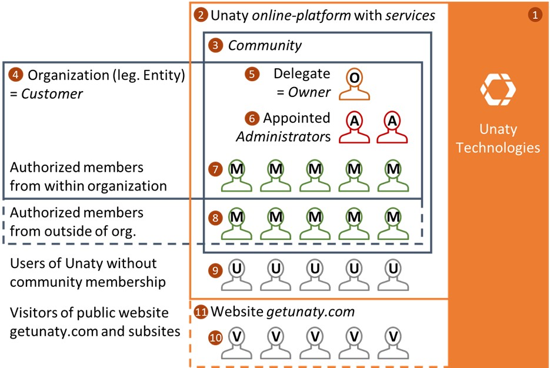

# **Overview and Definitions**

---

- **Welcome to Unaty!**  
- **Definitions**  
 - **Subjects and objects**  
 - **Roles**  
 - **Processes**  
- **Contracts**  
- **General**  
 - **Affiliated companies and websites**  
 - **Imprint for getunaty.com**  
 - **Archive**  

---

## Welcome to Unaty!

To ensure a smooth collaboration where you can rely on Unaty and we can rely on you, we have put together these pages. When we work together, you assume a role in relation to Unaty (=process). By assuming or changing your role, you enter certain contracts with us as a company. We want to clearly state here what your and our rights and obligations are in these roles. For now, here are some definitions that are binding for all subsequent documents and contracts.

## Definitions

### Subjects and objects

#### We = Unaty Technologies (1)

When we write &quot;Unaty&quot; or &quot;We&quot; (and respectively &quot;us&quot;) on the following pages, we mean Unaty Technologies GmbH, Unertlstraße 27, D-80803 Munich, Germany, and its affiliates. You can find more information about the affiliated companies and their websites in the respective section of this page.

#### Unaty online platform with services (2)

Unaty offers a software solution to support member organizations and makes it available for use via the Internet on their websites as a web application (online platform). We refer to the concrete functional scope of the software we offer as &quot;services&quot;.

#### Community = The Unaty instance of your organization on our online platform (3)

A community is an instance of our online platform Unaty and a dedicated virtual working environment for an organization to use the services. A Community represents an organization, i.e., a legal entity, on Unaty. A Community is created by an authorized or empowered representative of the organization, the Owner (5). There must be at least one owner per community.

#### Customer = The organization that uses the community (4)

There can be only one customer per community. If the organization is represented by the creator of the community, then that organization is the customer. By agreeing to our contracts, the creator of a community declares that is authorized to represent or is authorized by the organization for which the community is intended. Examples of authorization for this form of representation could be the position of President, Board of Directors for IT, or Member Management. If this is not the case, for example, if the creator is not formally affiliated with the organization for which you are creating a community, then you are our customer as a private individual (natural person). This special case is specifically addressed in the terms and conditions for customers.

### Roles

These roles are legal and technical subjects of the Unaty platform and should not be confused with the customizable roles that customers can create and use within the communities.

#### Owner = The person authorized by the customer to manage the community (5)

When you create a community, you are assigned the role of &quot;owner&quot; of the community. If the customer is an organization, the owner is always the representative of the customer or organization who signs this contract for the customer. The Owner role can be assigned to another representative of the customer. The role of the Owner includes special administrative rights for the Community, which include closing the Community and deleting all Community data. If the customer chooses to replace You as the representative with ultimate Owner authority for the Community, we will notify you accordingly upon such decision. You agree to take actions reasonably requested by us or the Customer to facilitate the transfer of authority to a new representative of Customer. If you are our customer as an individual, then the role of Owner is synonymous with the customer.

#### Administrator = Owner-appointed administrator of data and services in the community (6)

Administrators are technical administrators of the customer&#39;s community instance on Unaty and help manage data and services and maintain member data, groups, roles, and settings. They are not legal representatives of the owner, only the owner represents the customer, i.e., the organization behind the community, legally on the platform and in the services.

#### Members = Unaty users with access to a community (7) and (8)

Members are part of a community on Unaty without having special additional legal responsibilities there. Independently of this, they can of course be given certain rights and tasks within the community, which are defined by the owner and administrators. It is irrelevant whether you are formally part of the organization outside of Unaty (7), which is represented as a community on Unaty or not (8) - by invitation or permission of the Unaty customer behind a community, you are an authorized member of the community on Unaty.

Behind each community is a customer, either an organization or an individual, who has certain responsibilities for the members who belong to it.

#### Unaty users without community membership (9)

Outside of the communities, there is an online platform on Unaty called the Unaverse. This is a public area where you can make settings and explore the public profiles of communities. For some of them, you can even apply for membership directly. In any case, you are a user of our online platform even without being a member of a community.

#### Visitors to our website, Visitor (10)

When you visit our website getunaty.com, you are a visitor - even without registering or logging in as a user. Welcome to our website! We will ask you if we may store certain settings of you via cookies and learn anonymously from your use of the website in order to improve it. Thank you!

#### You = representative (5) of the customer (4), user (9), or visitor of our website (10)

When we address you as &quot;You&quot; (and respectively &quot;You&quot;, &quot;Your(s)&quot; &quot;You&quot;) on the following pages, we are addressing you in your respective roles as a contractual partner of Unaty. These roles are either the direct representative (5) of the customer or organization (4), the member authorized by invitation or permission of a community (7 or 8, as a user (9) of our platform without membership, or as a visitor to our website (10). At the beginning of each contract, it is again clearly stated who we mean and address with personal pronouns. All personal pronouns at Unaty are genderless.

### Processes

Processes describe the assumption of roles, accompanied by the conclusion of contracts in relation to us or one another.

#### A. Visit our website

Assumption of the role: visitor (10) by any person.
 The process becomes effective by visiting the public website or its subpages.

To visit getunaty.com is necessary to conclude the following contracts with us:

- Unaty Website Privacy Policy and Cookie Policy

#### B. Sign in and create a Unaty account

Assumption of the role of user (9) by a visitor (10)
 The process becomes effective by clicking the &quot;Create Account&quot; button.

In order to create an account and become a user, it is necessary to conclude the following contracts with us:

- Unaty + Community Code of Conduct for Users
- Unaty Data Privacy Policy for Users
- Unaty Usage Terms for Users

#### C. Create a community

Assumption of the role Owner (5) by a user (User, 9).
The process becomes effective by a confirmation sent to us after a user creates a community by clicking the button &quot;Create Community&quot;.

In order to create a community, the user must enter the following contracts with Unaty on behalf of the Customer (whether organization or himself as an individual):

- Unaty + Community Code of Conduct for Users
- Unaty Community Terms and Conditions for Customers
- Unaty Community Data Processing Agreement for Customers

After our confirmation of these contracts, the user becomes the owner (5) of the created community.

#### D. Apply for membership in a community (join community)

Assumption of the role of member (7 or 8) by a user (9)
 The process becomes effective when the membership request is approved by an administrator of the community. Before that, a user submits a request for membership in the community in the so-called Unaverse (general area of the platform outside of communities) by clicking the &quot;Join Community&quot; button.

In order to become a member of a community, it may be necessary for the applying user to enter prior contracts with the customer (i.e., the organization behind the community). This should at least be the

- Community Terms of Use for Members
- Community Privacy Policy for Members

The administration of these contracts and other agreements within the community is possible via the Unaty platform but is the sole responsibility of the owner and the administrators. If you have questions about these contracts, please contact the administrators of the respective community.

#### E. Become a member of a community by invitation

Direct assumption of the role of user (9) and member (7 or 8) by any person on invitation. The process becomes effective by clicking the &quot;Create Account&quot; button if an invitation to a community was previously made by an administrator of this community.

In doing so, the person firstly becomes a user (9) of Unaty:

In order to become a user of our platform it is necessary to conclude the following contracts with us:

- Unaty + Community Code of Conduct for Users
- Unaty Data Privacy Policy for Users
- Unaty Usage Terms for Users

Second, the person becomes a member of the community (7 or 8):

In order to become a member of a community, it may be necessary for the applying user to enter into prior contracts with the customer (i.e., for example, the organization behind the community). This should at least be the

- Community Terms of Use for Members
- Community Privacy Policy for Members

The administration of these contracts and other agreements within the community is possible via the Unaty platform but is the sole responsibility of the owner and the administrators. If you have questions about these contracts, please contact the administrators of the respective community.

#### F. Be appointed administrator

Assumption of the role of administrator (6) by a member of a community. The
 process becomes effective when a member is appointed as an administrator by the owner (5) by clicking the &quot;Make Admin&quot; button in the &quot;Settings&quot; section of the community.

It is not necessary to sign additional contracts with Unaty for this purpose. However, the organization behind the community may decide certain requirements and obligations for administrators of their community on the Unaty online platform.

#### G. Add owner

Assumption of the role of owner (5) by a member of a Community.
 The process becomes effective upon confirmation of an informal request by an existing Owner on behalf of the Customer to Unaty Technologies. Unless otherwise requested, the first existing Owner remains the actual representative of the Customer, and newly added Owners are merely representatives of the first existing Owner. Should an Owner intend to fully relinquish the role of Customer&#39;s representative to another member, it may be necessary to transfer or re-enter certain contracts.

Taking the role owner (5) of a new community by a user (9) of Unaty is described in the process &quot;Create Community&quot;.

### Contracts

Contracts describe the binding regulation of rights and obligations between Unaty, subjects, and roles.

#### Unaty Website Privacy and Cookie Policy

**Contractual partners:** visitors (10) to our public website and Unaty.  
**Content:** Consent to the collection and processing of data through the website, including with the help of so-called cookies.  
**Closing process:** pop-up window asking for consent when visiting our website (Process A).  
**Update process:** We will ask you to give your consent again after changes in the next login.  

#### Unaty + Community Code of Conduct for Users and Unaty Usage Terms for Users

**Contractual partners** : All users (9) of our online platform and Unaty.  
**Content:** Here we agree on behaviors, and we disclose what data we collect from you and process.  
**Conclusion process:** You will be prompted during process B when creating a user account to read the contract and agree to it by checking the appropriate box. Even if you become a member directly via an invitation, you create a user account, and it is required that you agree to the contracts.  
**Update process:** We will ask you to agree again after changes at the next registration. There you can read the contract at your leisure and agree by checking the box for this contract.  

#### Unaty Community Terms and Conditions for Customers

**Contractual partners:** The customer, i.e., the organization behind the community, and Unaty.  
**Content** : Regulation of the terms and conditions for software provision in the cloud, which legally depicts the services on our online platform.  
**Closing Process:** On behalf of the Customer, the Owner will close this contract with Unaty when we confirm the creation of a Community (Process C).  
**Update Process:** During its sign-up process, we will ask the Owner on behalf of the Customer to reconfirm the contract if there has been a change.  

#### Unaty Community Data Processing Agreement for Customers

**Contractual partners:** The customer, i.e., the organization behind the community, and Unaty.  
**Content:** Unaty processes personal data on behalf of the customer following the General Data Protection Regulation. Here, the customer is the controller of the organization&#39;s personal data, while Unaty acts as a processor. We disclose here exactly how we and our partners process and share personal data with partners in a privacy-compliant manner.  
**Closing Process:** On behalf of the customer, the owner closes this contract with Unaty when we confirm the creation of a community (Process C).  
**Update Process:** During its sign-up process, we will ask the Owner on behalf of the Customer to reconfirm the contract if there has been a change.  

#### Unaty Data Privacy Policy for Users

**Contractual partners:** All users (users, 9) of our online platform and Unaty.  
**Content:** Here we disclose what personal data Unaty collects and processes in the general user area of the online platform outside the communities, the Unaverse. At your request, we may transfer this data to a Community or synchronize data between your Communities. Here we explain how we treat the data confidentially and protect it. Please note that the personal data collected within the communities is mostly collected by the customer, i.e. the organization behind the community. Where this is sometimes not the case, we explain in our Data Privacy Policy.  
**Closing process:** During process B, when creating a user account, you will be asked to read the contract and agree to it by checking the appropriate box. Even if you become a member directly via an invitation, you create a user account and it is required that you agree to the contracts.  
**Update process:** We will ask you to agree again after changes at the next registration. There you can read the contract at your leisure and agree by checking the box for this contract.  

#### Community Terms of use of the Customer for Members

Organizations can use Unaty Services to open policies to their members and document their members&#39; agreement with them.

**Contractual partners:** All members of a community and the customer, i.e., the organization behind the community on the online platform.  
**Content:** Regulation of community-specific rules of conduct  
**Conclusion process:** When you become a member of a community, the organization behind the community can demand that you agree to the terms of use. This can be done after confirming your application to join the community (process D) or when creating a user account after receiving an invitation (process E). Here you will be asked to read the terms of use and agree to them by checking the appropriate box.  
**Update process:** The organization behind the community will ask you to agree to changes the next time you log in. You can read everything at your leisure and agree again by checking the appropriate box.  

#### Community Privacy Policy (of the Customer) for Members

Organizations can use Unaty Services to disclose to their members what personal data about their members they collect and process using Unaty Services and document consent to do so.

**Contractual partners:** All members of a community and the customer, i.e. the organization behind the community on the online platform.  
**Content:** Consent to the collection and processing of personal data in the community by the organization. This also includes commissioned processing by the organization&#39;s service providers, for example, Unaty.  
**Closing process:** When you become a member of a community, the organization behind the community asks you to agree to the privacy policy. This can be done after confirming your application to join the community (process D) or when creating a user account after receiving an invitation (process E). Here you will be asked to read the privacy policy and agree to it by checking the appropriate box.  
**Update process:** The organization behind the community will ask you to agree to changes the next time you log in. You can read everything at your leisure and agree again by checking the appropriate box.  

## General

### Affiliated companies and websites

#### Unaty Incorporated

4565 N 144th St.,  
 Brookfield WI, 53005  
 United States of America  

#### Isaria Capital UG

Unertlstr. 27,  
 80803 Munich,  
 Germany

### Imprint for getunaty.com

Information according to § 5 TMG:

**Operator and responsible for the content:** Unaty Technologies GmbH, Unertsltraße 27, 80803 Munich, Germany  
**Management:** Sean McCall  
**Data Protection Officer:** Fabian Ahrens  
**Privacy:**  
If you have any questions or comments on the subject of data privacy or the assertion of data subject rights, you can reach our data privacy team at the e-mail address dataprivacy@getunaty.com. Please include the note &quot;Personal - Data privacy&quot; with any submissions on this matter.

**Contact:** [hey@getunaty.com](mailto:hey@getunaty.com)  
**Commercial Register:** HRB 233951, Commercial Register B of the Munich Local Court  
**Sales tax identification number:** DE 312 532 117 (according to §27 a sales tax law)  
**Realization of the website by:** Unaty Technologies GmbH, address as above  

**Use of our contact information:**  
The use of contact data published within the framework of the imprint obligation by third parties for the purpose of sending unsolicited advertising and information materials is hereby expressly prohibited. The operators of the pages expressly reserve the right to take legal action in the event of the unsolicited sending of advertising information, such as spam e-mails.

**Website availability:**  
We will make every effort to offer our service and the contents of the website for retrieval without interruption as far as possible. However, even with all due care, downtimes cannot be ruled out. The offer can be changed or discontinued at any time. We cannot accept any liability for interruptions or other disruptions caused by files that have not been created without errors or formats that have not been structured without errors.

### Archive

Since June 2021, you can track all changes to our policy repository published here on GitHub: Policy Repository
